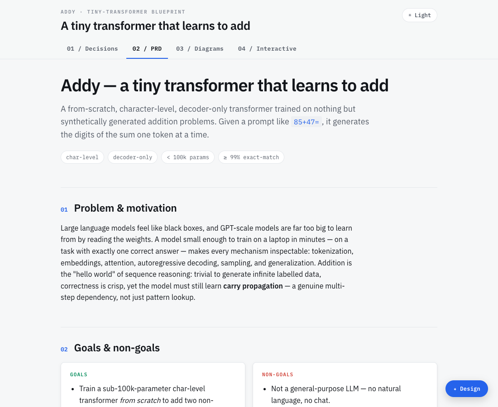
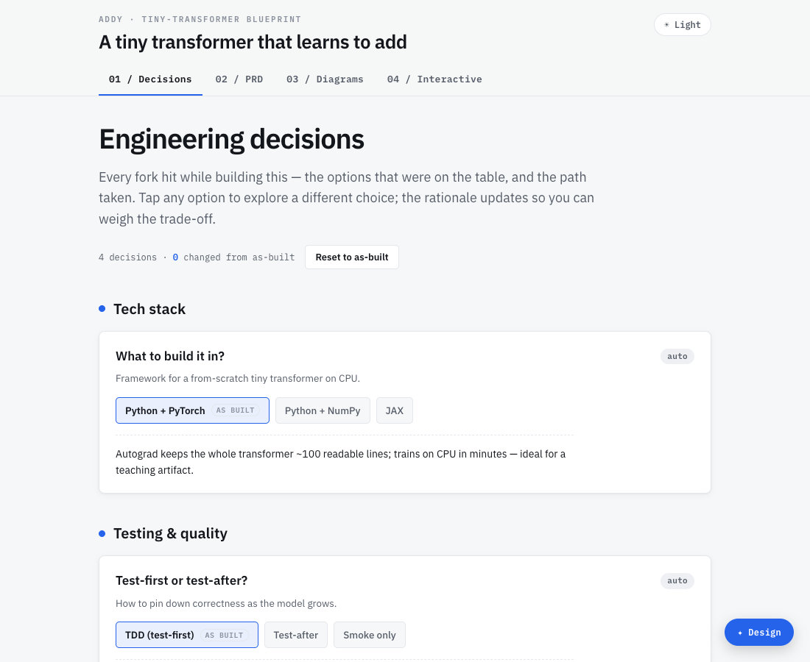

<div align="center">

# Agent Skills

**Installable [Agent Skills](https://code.claude.com/docs/en/skills) for Claude Code that turn ideas into polished, self-contained deliverables.**

[](LICENSE)
[](https://code.claude.com/docs/en/skills)
[](#-skills)
[](https://github.com/SameehShkeer/agent-skills/commits)

<picture>
  <source media="(prefers-color-scheme: dark)" srcset="docs/assets/hero-dark.png">
  
</picture>

<sub>One prompt → one self-contained HTML file. No build step, opens in any browser, light or dark.</sub>

</div>

---

A hand-built collection of Agent Skills for [Claude Code](https://www.claude.com/product/claude-code). Each skill is a self-contained capability you install once and invoke with a slash command — no servers, no glue code.

- 📄 **Real deliverables, not chat** — skills here produce polished, openable artifacts you can read, share, and poke at.
- 📦 **Self-contained output** — a single HTML file with everything inlined; opens offline in any browser.
- 🎨 **Designed, not generic** — a configurable design system (light/dark, typeface, accent) is baked in.
- 🔌 **Drop-in install** — one command in Claude Code, or copy a folder. Works today.

## 🚀 Quickstart

> Get a skill running in under a minute. Pick either path.

**Option A — plugin marketplace (one-liner, recommended)**

In Claude Code:

```text
/plugin marketplace add SameehShkeer/agent-skills
/plugin install project-blueprint@sameeh-skills
```

**Option B — manual install (no marketplace)**

```bash
git clone https://github.com/SameehShkeer/agent-skills ~/src/agent-skills
mkdir -p ~/.claude/skills
ln -s ~/src/agent-skills/skills/project-blueprint ~/.claude/skills/project-blueprint
```

Then, in Claude Code:

```text
/project-blueprint spec out a habit-tracker app
```

You'll get a `*-blueprint.html` you can open in any browser. ✨

**▶️ [See a real output (live demo)](https://sameehshkeer.github.io/agent-skills/examples/project-blueprint-addy-demo.html)** — the actual generated HTML, hosted on GitHub Pages.

## 🧩 Skills

<table>
<tr>
<td width="42%" valign="top">
  <a href="skills/project-blueprint/"></a>
</td>
<td width="58%" valign="top">

### [project-blueprint](skills/project-blueprint/) &nbsp;<sub>`Stable`</sub>

Turn a project idea into one self-contained HTML file with four tabs:

- **Decisions** — an interactive design-decision log; tap options to weigh trade-offs
- **PRD** — a real product requirements doc in an editorial layout
- **Diagrams** — class, component, sequence, activity & state (Mermaid, themed live)
- **Interactive** — hands-on widgets that teach the project's core concepts

Add `grill me` to be interviewed on the design decisions (TDD, DDD, architecture…).

```text
/project-blueprint <your idea>
```

</td>
</tr>
</table>

<sub>More skills coming. Want to add one? See **[CONTRIBUTING](CONTRIBUTING.md)** and the **[`template/`](template/)** scaffold.</sub>

<details>
<summary><b>What project-blueprint generates (and how)</b></summary>

<br>

- A single `.html` file — three sections of content (Decisions/PRD/Diagrams/Interactive) plus a floating **✦ Design** panel to switch light/dark, "vibe" (corner radii), typeface, and accent.
- **Truly offline:** the build step renders each Mermaid diagram to inline SVG (in both light *and* dark) and strips the CDN, so the shipped file needs no network. The only external touch is Google Fonts, which gracefully falls back to system fonts offline.
- **Validated before it ships:** a bundled headless-browser check renders every diagram, smoke-tests every widget, and confirms the Decisions tab and theme switcher work — in both themes.
- Optional `grill me` mode interviews you on key engineering decisions and records them; otherwise it decides and logs them automatically.

The skill bundles its own `SKILL.md`, `references/`, `assets/` (the design system + template), `scripts/` (the build/validate tooling), and `evals/`. See **[skills/project-blueprint/](skills/project-blueprint/)**.

</details>

## ➕ Add your own skill

1. Copy [`template/`](template/) to `skills/<your-skill-name>/` (folder name = the skill's `name`).
2. Fill in `SKILL.md` (a `name` + a `description` that says *what it does and when to use it*).
3. Add it to [`.claude-plugin/marketplace.json`](.claude-plugin/marketplace.json).
4. Open a PR — see **[CONTRIBUTING.md](CONTRIBUTING.md)**.

## 🛟 Trust & safety

Skills are **runnable**: they contain instructions and scripts an AI agent executes on *your* machine, with *your* privileges. Treat installing one like installing software — **review it first**. See **[SECURITY.md](SECURITY.md)**.

[License (MIT)](LICENSE) · [Contributing](CONTRIBUTING.md) · [Code of Conduct](CODE_OF_CONDUCT.md) · [Security](SECURITY.md)

## 📎 Notes

Built on Anthropic's [Agent Skills](https://code.claude.com/docs/en/skills) and the open [agentskills.io](https://agentskills.io) standard. Provided **as is**, without warranty. This is an independent, community project — **not affiliated with or endorsed by Anthropic**.
